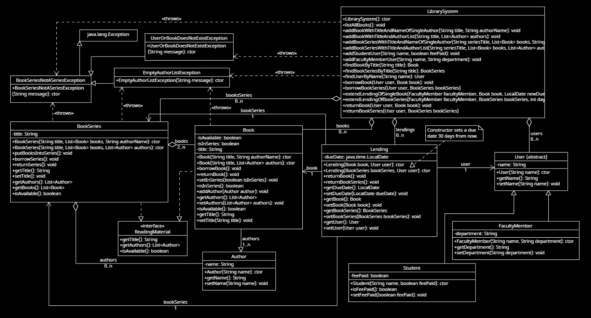

# Design Documentation

## UML Class Diagram
Here is the UML class diagram that shows the structure of the system.

## Design Patterns Used
1. **Composite Pattern**: The `LibrarySystem` uses a composite pattern to create books and book series

## Class Descriptions for a Composite Design pattern
- **ReadingMaterial**: a common interface for books and book series.
- **Book**: Represents a book that acts as a Leaf of ReadingMaterial.
- **BookSeries**: Represents a book series that acts as a Composite of ReadingMaterial and can contain Leaf of Book objects.
